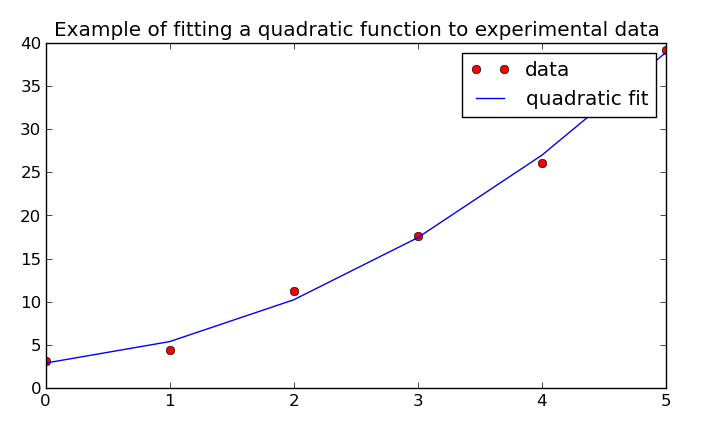

.. index:: linear algebra
.. _linear algebra:

==============
Linear Algebra
==============

The :mod:`ad.linalg` submodule was created to overcome the limitations
of performing AD with compiled numerical routines (e.g., LAPACK). The 
following algorithms have a translation that are AD-compatible:

* Decompositions
  
  - ``chol``: :ref:`Cholesky decomposition <chol>`
  - ``lu``: :ref:`LU decomposition <lu>`
  - ``qr``: :ref:`QR decomposition <qr>`

* Solving linear equations and matrix inverse

  - ``solve``: :ref:`General linear system solver <solve>`
  - ``lstsq``: :ref:`Least-squares system solver <lstsq>`
  - ``inv``: :ref:`Solve for (multiplicative) matrix inverse <inv>`

Each item listed above is a NumPy-equivalent function, though not 
completely interchangeable. The descriptions that follow are not
meant to introduce theory for the methods, nor to show an exhaustive
set of examples as to their usage. They simply describe the respective
algorithm's usage with some relevant examples. Several algorithms
have been borrowed from the tasks described at 
`RosettaCode <rosettacode.org>`.

Decompositions
==============

.. index:: Decomposition; Cholesky
    
.. _chol:

Cholesky Decomposition
----------------------

`Cholesky decomposition`_ involves taking a symmetric, positive-definite 
matrix A and decomposing it into L such that :math:`A=L*L^T=U^T*U`, 
where L is a lower triangular matrix and U is an upper triangular matrix.
    
Example 1::

    >>> A = [[25, 15, -5], 
    ...      [15, 18,  0], 
    ...      [-5,  0, 11]]
    ...
    >>> L = chol(A)
    >>> L
    array([[ 5.,  0.,  0.],
           [ 3.,  3.,  0.],
           [-1.,  1.,  3.]])
    >>> U = chol(A, 'upper')
    >>> U
    array([[ 5.,  3., -1.],
           [ 0.,  3.,  1.],
           [ 0.,  0.,  3.]])
        
Example 2::

    >>> A = [[18, 22,  54,  42], 
    ...      [22, 70,  86,  62], 
    ...      [54, 86, 174, 134], 
    ...      [42, 62, 134, 106]]
    ...
    >>> L = chol(A)
    >>> L
    array([[  4.24264069,   0.        ,   0.        ,   0.        ],
           [  5.18544973,   6.5659052 ,   0.        ,   0.        ],
           [ 12.72792206,   3.0460385 ,   1.64974225,   0.        ],
           [  9.89949494,   1.62455386,   1.84971101,   1.39262125]])

.. index:: Decomposition; LU
    
.. _lu:

LU Decomposition
----------------

`LU Decomposition`_ factors a matrix as the product of a lower triangular
matrix and an upper triangular matrix, and in this case, a pivot or
permutation matrix as well. The decomposition can be viewd as the matrix
form of `guassian elimination`. Computers usually solve square systems of
linear equations using the LU decomposition, and it is also a key step
when inverting a matrix, or computing the determinant of a matrix.

Example 1::

    >>> A = [[1, 3, 5],
    ...      [2, 4, 7],
    ...      [1, 1, 0]]
    ...
    >>> L, U, P = lu(A)
    >>> L
    array([[ 1. ,  0. ,  0. ],
           [ 0.5,  1. ,  0. ],
           [ 0.5, -1. ,  1. ]])
    >>> U
    array([[ 2. ,  4. ,  7. ],
           [ 0. ,  1. ,  1.5],
           [ 0. ,  0. , -2. ]])
    >>> P
    array([[ 0.,  1.,  0.],
           [ 1.,  0.,  0.],
           [ 0.,  0.,  1.]])

Example 2::

    >>> A = [[11,  9, 24, 2], 
    ...      [ 1,  5,  2, 6], 
    ...      [ 3, 17, 18, 1], 
    ...      [ 2,  5,  7, 1]]
    ...
    >>> L, U, P = lu(A)
    >>> L
    array([[ 1.        ,  0.        ,  0.        ,  0.        ],
           [ 0.27272727,  1.        ,  0.        ,  0.        ],
           [ 0.09090909,  0.2875    ,  1.        ,  0.        ],
           [ 0.18181818,  0.23125   ,  0.00359712,  1.        ]])
    >>> U
    array([[ 11.        ,   9.        ,  24.        ,   2.        ],
           [  0.        ,  14.54545455,  11.45454545,   0.45454545],
           [  0.        ,   0.        ,  -3.475     ,   5.6875    ],
           [  0.        ,   0.        ,   0.        ,   0.51079137]])
    >>> P
    array([[ 1.,  0.,  0.,  0.],
           [ 0.,  0.,  1.,  0.],
           [ 0.,  1.,  0.,  0.],
           [ 0.,  0.,  0.,  1.]])

.. index:: Decomposition; QR
    
.. _qr:

QR Decomposition
----------------

`QR Decomposition`_ is applicable to any m-by-n matrix *A* and decomposes
into :math:`A=QR` where *Q* is an orthogonal matrix of size m-by-m and
*R* is an upper triangular matrix of size m-by-n. QR decomposition provides
an alternative way of `solving the systems of equations <least squares>`
:math:`Ax=b` without inverting the matrix *A*. The fact that *Q* is 
orthogonal means that :math:`Q^T*Q=I`, so that :math:`Ax=b` is equivalent to :math:`Rx=Q^T*b`, which is easier to solve since *R* is triangular.
    
Example of a square input matrix::

    >>> A = [[12, -51,   4], 
    ...      [ 6, 167, -68], 
    ...      [-4,  24, -41]]
    ...
    >>> q, r = qr(A)
    >>> q
    array([[-0.85714286,  0.39428571,  0.33142857],
           [-0.42857143, -0.90285714, -0.03428571],
           [ 0.28571429, -0.17142857,  0.94285714]])
    >>> r
    array([[ -1.40000000e+01,  -2.10000000e+01,   1.40000000e+01],
           [  5.97812398e-18,  -1.75000000e+02,   7.00000000e+01],
           [  4.47505281e-16,   0.00000000e+00,  -3.50000000e+01]])

Example of a non-square input matrix::

    >>> A = [[12, -51,   4], 
    ...      [ 6, 167, -68], 
    ...      [-4,  24, -41], 
    ...      [-1,   1,   0], 
    ...      [ 2,   0,   3]]
    ...
    >>> q, r = qr(A)
    >>> q
    array([[-0.84641474,  0.39129081, -0.34312406,  0.06613742, -0.09146206],
           [-0.42320737, -0.90408727,  0.02927016,  0.01737854, -0.04861045],
           [ 0.28213825, -0.17042055, -0.93285599, -0.02194202,  0.14371187],
           [ 0.07053456, -0.01404065,  0.00109937,  0.99740066,  0.00429488],
           [-0.14106912,  0.01665551,  0.10577161,  0.00585613,  0.98417487]])
    >>> r
    array([[ -1.41774469e+01,  -2.06666265e+01,   1.34015667e+01],
           [  3.31666807e-16,  -1.75042539e+02,   7.00803066e+01],
           [ -3.36067949e-16,   2.87087579e-15,   3.52015430e+01],
           [  9.46898347e-17,   5.05117109e-17,  -9.49761103e-17],
           [ -1.74918720e-16,  -3.80190411e-16,   8.88178420e-16]])
    >>> import numpy as np
    >>> np.all(np.dot(q, r) - A<1e-12)
    True

Solving Systems of Equations and Matrix Inverse
===============================================

.. index:: Solving linear systems; general solver
    
.. _solve:

General linear system solver
----------------------------

The general solver for linear systems of equations uses 
`guassian elimination`_. One or multiple columns in the RHS can be input,
like when solving for the `matrix inverse <inv>`.

Example::

    >>> A = [[1, 2, 1], [4, 6, 3], [9, 8, 2]]
    >>> b = [3, 2, 1]
    >>> solve(A, b)
    array([ -7.,  11., -12.])

.. index:: Solving linear systems; least-squares
    
.. _lstsq:

Least-squares linear system solver
----------------------------------

Solving a system of linear equations using the `least squares`_ method
involves the usage of `QR decomposition <least squares>`_.

Example: Fit a quadratic line to some experimental data::

    >>> x = np.array([0, 1, 2, 3, 4, 5])
    >>> y = np.array([3, 6, 11, 18, 27, 38])
    >>> y = y + np.random.randn(len(y))  # give the output a random offset
    >>> A = np.vstack([np.ones(len(x)), x, x**2]).T
    >>> A
    array([])
    >>> b = lstsq(A, y)  # the quadratic fit coefficients (b0 + b1*x + b2*x**2)
    
Now, we can see what the fit looks like compared to the original data using
Matplotlib::

    >>> fit = lambda x: b[0] + b[1]*x + b[2]*x**2
    >>> import matplotlib.pyplot as plt
    >>> plt.plot(x, y, 'ro', x, fit(x), 'b-')
    >>> plt.legend(['data', 'quadratic fit'])
    >>> plt.show()

.. index:: Matrix inverse
    
.. _inv:

Matrix Inverse
--------------

Solving for a `matrix inverse`_ is performed using :func:`inv`.
Internally, this is done using the general solver and inputting the
an appropriately sized identity matrix as the RHS of the system.

Example::

    >>> A = [[25, 15, -5], 
    ...      [15, 18,  0], 
    ...      [-5,  0, 11]]
    ...
    >>> Ainv = inv(A)
    >>> Ainv
    array([[ 0.09777778, -0.08148148,  0.04444444],
           [-0.08148148,  0.12345679, -0.03703704],
           [ 0.04444444, -0.03703704,  0.11111111]])
    >>> np.dot(Ainv, A)
    array([[  1.00000000e+00,   0.00000000e+00,   0.00000000e+00],
           [  2.77555756e-16,   1.00000000e+00,   0.00000000e+00],
           [  0.00000000e+00,   1.11022302e-16,   1.00000000e+00]])

You'll notice that the off-diagonal elements aren't all perfectly zero. This
is due to floating-point error, but otherwise the final matrix is the 
identity matrix.

.. _Cholesky decomposition: http://en.wikipedia.org/wiki/Cholesky_decomposition
.. _LU decomposition: http://en.wikipedia.org/wiki/LU_decomposition
.. _QR decomposition: http://en.wikipedia.org/wiki/QR_decomposition
.. _gaussian elimination: http://en.wikipedia.org/wiki/Gaussian_elimination
.. _least squares: http://en.wikipedia.org/wiki/Linear_least_squares_(mathematics)#Orthogonal_decomposition_methods
.. _matrix inverse: http://en.wikipedia.org/wiki/Gaussian_elimination#Finding_the_inverse_of_a_matrix
